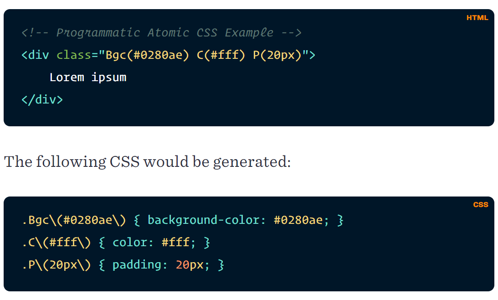
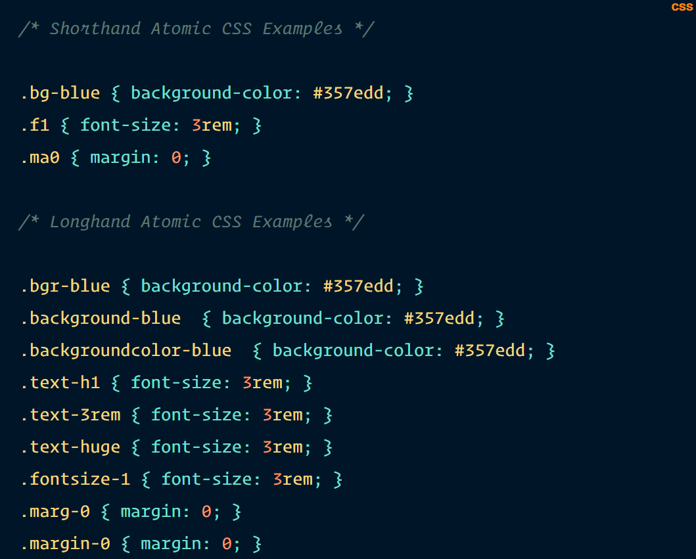

## Atomic / Utility-first / Functional CSS 

>*Atomic CSS is a architectural philosophy that favors small, single-purpose classes to help building.*
>
>Atomic CSS 是一种建筑哲学，主张以小型、单一用途的类帮助建设。

有几种风格

### Programmatic 编程式

>  *e.g.* [Styled Components](https://styled-components.com/)*,* [Emotion](https://emotion.sh/)*,* [Theme UI](https://theme-ui.com/)*,* [ACSS.io](http://acss.io/))

借助构建工具在 html 上像调用函数一样写样式，这样就不用再写任何的样式文件。

### Static 静态类

> *e.g.* [Tachyons](http://tachyons.io/)*,* [Tailwind](https://tailwindcss.com/)

更高的可读性

> 参考资料：
>
> [The Case for Atomic / Utility-First CSS](https://johnpolacek.github.io/the-case-for-atomic-css/)（Atomic CSS 的文章集合）
>
> [Let's define exactly what Atomic Css is](https://css-tricks.com/lets-define-exactly-atomic-css/)
