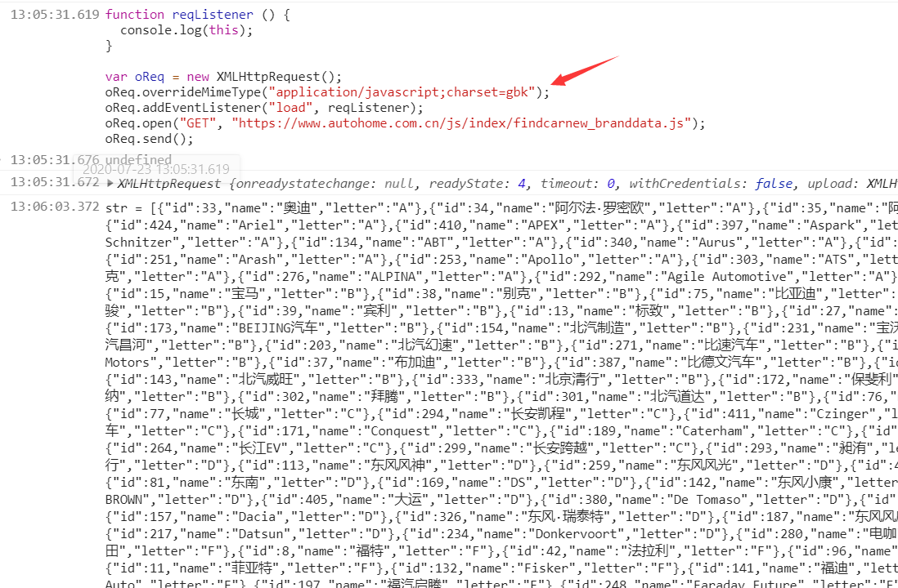
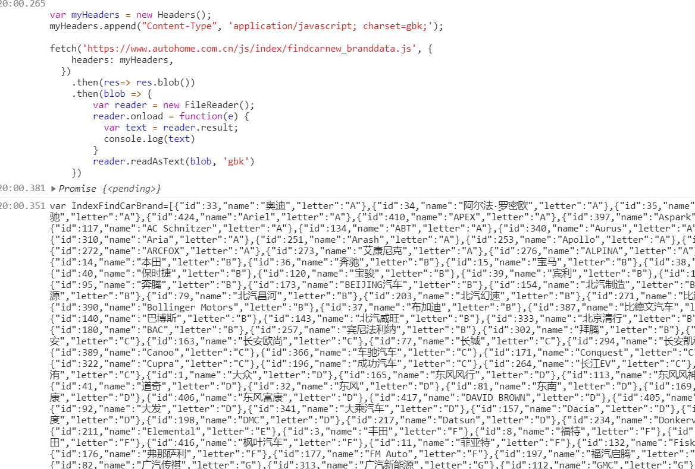

### 读第三方接口，看到的都是乱码

编码错误会导致乱码

查看 network 可以清楚的看到 response 返回的 content-type ，如果 content-type 没有包含 charset， 那会是服务器的默认编码方式。

下图所示，它没有指定 charset 且编码方式是 GBK


这样的情况，返回数据显示的中文部分会是乱码。

所以，要对它返回的数据进行编码转换后才能正常使用。

> **注意**： [GBK与UTF-8编码错误转换后，无法再正确恢复](https://www.cnblogs.com/DataArt/p/10010878.html)
>
> 被错误字符集转换过的字符串，无法恢复到原来的字符集。
>
> 造成该问题的根源是**字节**发生了变化。GBK或UTF-8遇到无法解析的字符时，会使用特殊的字符代替，因此造成原有字节信息的丢失，无法恢复。

#### XMLHttpRequest

overrideMimeType 可以强制设置响应时的处理类型

> XMLHttpRequest 的 **overrideMimeType** 方法是指定一个MIME类型用于替代服务器指定的类型，使服务端响应信息中传输的数据按照该指定MIME类型处理。例如强制使流方式处理为"text/xml"类型处理时会被使用到，即使服务器在响应头中并没有这样指定。此方法必须在send方法之前调用方为有效。
>
> https://developer.mozilla.org/zh-CN/docs/Web/API/XMLHttpRequest/overrideMimeType

```js
function reqListener () {
  console.log(this);
}
var oReq = new XMLHttpRequest();
oReq.overrideMimeType("application/javascript;charset=gbk");
oReq.addEventListener("load", reqListener);
oReq.open("GET", "https://www.autohome.com.cn/js/index/findcarnew_branddata.js");
oReq.send();
```



#### fetch

fetch 可以拿到 blob 后通过 FileReader.readAsText 设置编码方式

```js

fetch('https://www.autohome.com.cn/js/index/findcarnew_branddata.js')
    .then(res=> res.blob())
    .then(blob => {
        var reader = new FileReader();
        reader.onload = function(e) {
          var text = reader.result;
          console.log(text)
        }
        reader.readAsText(blob, 'gbk') 
    })
```

