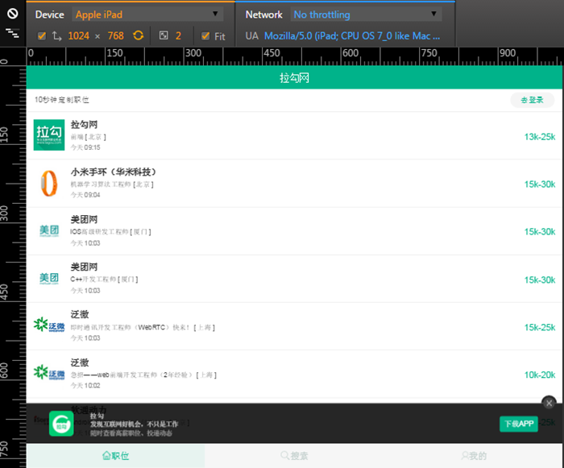
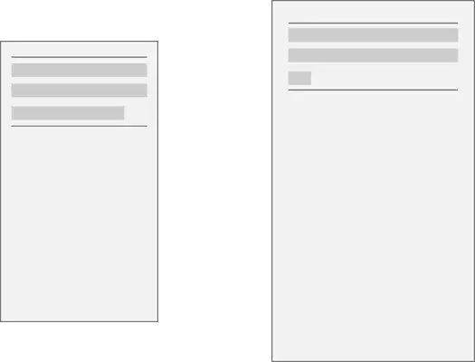
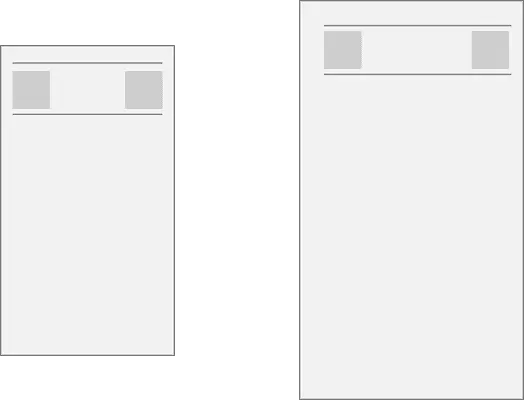
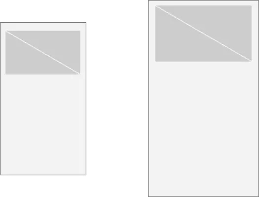

# 页面布局屏幕适配

> [iPhone 屏幕分辨率和适配规则（规则篇）](https://www.jianshu.com/p/1b24ca5e8c12)
>
> [Rem 布局的原理解析-颜海镜](https://yanhaijing.com/css/2017/09/29/principle-of-rem-layout/)
>
> [uni-app 屏幕适配指南——包括横屏情况下的适配方案](https://uniapp.dcloud.io/adapt)
>
> [uni-app 页面样式与布局](https://uniapp.dcloud.io/frame?id=%e9%a1%b5%e9%9d%a2%e6%a0%b7%e5%bc%8f%e4%b8%8e%e5%b8%83%e5%b1%80)

屏幕适配没有银弹，还是要看需求。

**各单位使用指南**

- `width`、`height`

  - `flex`、`%`，建议弹性布局
  - `rpx` 、`vw` 、`rem`，等比缩放可以在不同屏幕看起来有一样的效果
  - `px`，也可以考虑，特别是要兼容横竖屏切换的情况下

- `padding`、`margin`
- `rpx` 、`vw` 、`rem`，等比缩放可以在不同屏幕看起来有一样的效果
- `px`，也可以考虑，特别是要兼容横竖屏切换的情况下
- `font-size`
  - `rpx`，文字等比缩放，也不是不能接受
  - `px`，不同屏幕固定的字体大小是合理的，最多加一点媒体查询
  - `em`，值得考虑，还能照顾到用户的设定
- `border-radius`
  - `rpx` 、`vw` 、`rem`，弧度保持一致
  - `px`，在不同尺寸屏幕下，如果容器不是固定大小，那么弧度与容器大小呈反比，容器越大时弧度看起来越小；容器固定大小，弧度一致
  - `%`，百分比是根据容器的宽高计算垂直/水平半径从而得到弧度的，所以，非正方形得到的弧度是椭圆的
  - [border-radius 工作原理](https://zhuanlan.zhihu.com/p/20128284)

**tips**

- width、height、padding、margin、border-radius 这样紧密相关的元素建议统一单位

